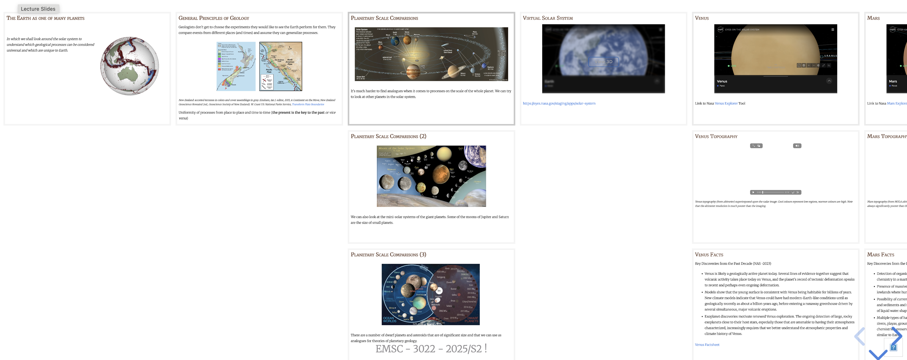
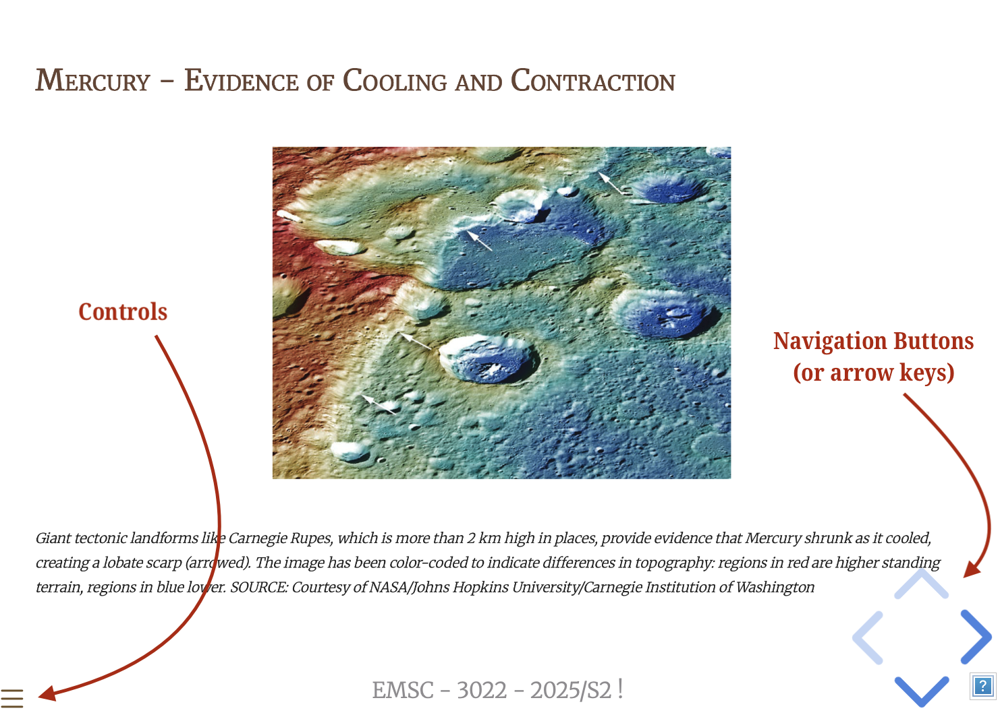
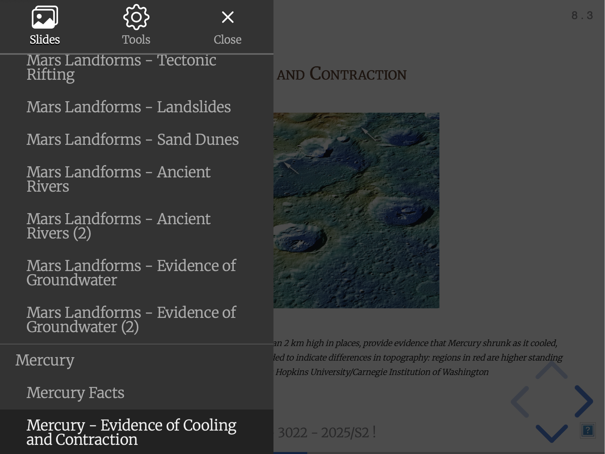

Summary of course material for week 5 of EMSC 3022 (Planetary Science), 2025 edition.

There are two sets of lecture materials in this section of the Planetary Science course. The first is a [guide book to the terrestrial planets](../../slides/Slides-SS-SolidPlanets.html) of the solar system. We'll review this material, but it is mostly there for you to browse for later lectures in the course.

There are three mini-lectures on how we probe the interior structure of planets focussing on seismology and thermal evolution (including a brief overview of mantle convection). You can navigate to this material from the sidebar (on the left).

 - [Notes: Solar System Solid Planets](LectureMaterials/SolarSystemSolidPlanets.html)
 - [Notes: Solid Planets 1](LectureMaterials/Solid-Planets-1.html)
 - [Notes: Solid Planets 2](LectureMaterials/Solid-Planets-2.html)
 - [Notes: Solid Planets 3](LectureMaterials/Solid-Planets-3.html)

These are links directly to the slide-shows in case your browser doesn't like the embedded presentations !

 - [Slides: Solar System Solid Planets](../slides/Slides-SS-SolidPlanets.html)
 - [Slides: Solid Planets 1](../slides/Slides-PlanetaryGeophysics-1.html)
 - [Slides: Solid Planets 2](../slides/Slides-PlanetaryGeophysics-2.html)
 - [Slides: Solid Planets 3](../slides/Slides-PlanetaryGeophysics-3.html)

You can read all of this material from this website. See the information below for details on how to navigate the slides and find all the additional material.

## Slides / Navigation

There are lecture-slideshows in this document that you can also follow at your own pace. There are full sets of lecture slides and are 100% available online.

{width="480px"}

:::{style="font-size:100%;"}
*Slides are laid out in 2D. The general flow is left-to-right but when there is additional material on a topic, there is an extra navigation direction to go down as well. To toggle this view, press the 'o' key when the pointer is over the presentation*
:::

{width="480px"}

:::{style="font-size:100%;"}
*The "navigation-arrows show you when there is extra material to view in the downward direction. You can click the arrows or just use the arrow keys on your browser*
:::

{width="480px"}

:::{style="font-size:100%;"}
*The control-menu pops up as a navigation aid for the presentation and also has a list of keyboard shortcuts (under the cog symbol)*
:::

You can see the slides in full-screen by hitting the <kbd>f</kbd> key and use <kbd>Esc</kbd> to return to the window.
