# Probing Planetary Interiors

How do we know what is inside a planet ?

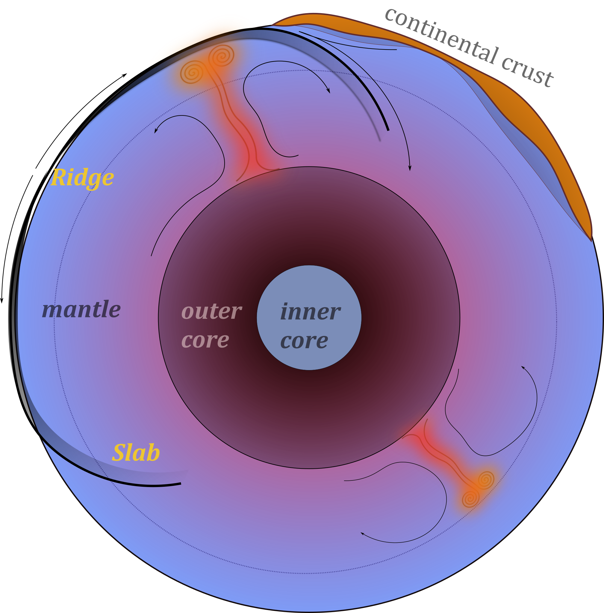

The circulation currents in the *solid mantle* move at a few cm/yr and plate motions are
part of the overall circulation. On a global scale, movement is slow and viscous, especially in the deep mantle.

Mantle Plumes are also part of the overall circulation but much smaller than the slabs because
they are cylindrical rather than sheets. Flow in the mantle is broad scale - small structures induce broad flow.

Other solid planets should follow the same basic physical models as the Earth, so it's best to learn how things work on the most-instrumented planet first of all.

# Mantle Convection

Convection in Earth’s interior is (a little bit) like a boiling pot (as we saw in a previous lecture)

{fig-align="center" height="300px"} &nbsp;
{fig-align="center" height="300px"}

The hot soup rises to the surface, spreads and begins to cool, and then sinks back to the bottom of the pot where it is reheated and rises again. **Why does hot soup rise and cold soup sink** ?

# General Observations on Convection

:::: {.columns}

::: {.column width="66%"}
Without being particularly quantitative:

  - Hot liquid is more buoyant than cold material **and it tends to rise**
  - Cooler liquid is less buoyant and **therefore tends to sink**
  - This can only happen if the two can **move past each other**
  - Convection produces a self-stirring

:::

::: {.column width="34%"}
{fig-align="right" height="200px"}
:::

::::

Buoyancy forces are at work and viscous forces counteract these forces once the fluid is moving

$$
\textrm{buoyancy} \propto g \rho_0 \alpha(1-\Delta T)
$$

Convection like this will only work when the soup is heated from below or, in the case of the Earth, if it is heated from within by radioactivity. **(Can you see why) ?**

## General Observations on Convection

**Definition**:  Convection is the transfer of heat by the self-organised movement of a fluid. Free convection is when the fluid is stirred entirely by rising buoyant material and sinking negatively-buoyant material. (Forced convection is produced when the fluid is stirred mechanically).

<video autoplay controls width="33%">
    <source src="movies/LavaLampNormalSpeed.m4v"
            type="video/mp4">

    Sorry, your browser doesn't support embedded videos.
</video>

Convection is one of the ways we transfer heat from hot regions deep in the Earth to cooler, shallow regions.

# Heat Transfer

Other ways that heat can be transferred include *radiation*, *advection*, and *conduction*.

:::: {.columns}

::: {.column width="60%"}

**Advection** of heat is where some object carries an excess (or defecit of) heat energy from place to place.

**Conduction** is the transfer of heat (or electric current) from one substance to another by direct contact (lattice vibrations / electrons).

**Radiation** is the transfer of heat energy by photons that pass between two materials. It does not require any physical contact or indermediary material (e.g. it is not a problem to transfer heat across a vacuum this way).
:::

::: {.column width="40%"}

:::

::::

# Conduction & Fourier's Law - i

:::: {.columns}

::: {.column width="60%"}
**Fourier's Law** tells us how much heat, $Q$ is conducted through a sample in a unit time

$$
  Q=-\frac{k A \Delta T}{L}
$$

$A$ is the cross sectional area of the sample, $L$ is its length, $k$ is a thermal conductivity “constant” dependent on the nature of the material and often also on the temperature, and $\Delta T$ is the temperature difference across the sample. (Note the minus sign because heat will always flow from a higher temperature to a lower temperature.)
:::

::: {.column width="40%"}
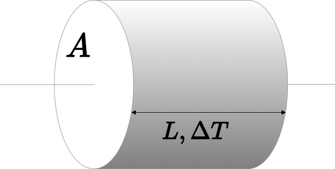
:::

::::

## Conduction & Fourier's Law - ii

**Fourier's Law** is explained using a simple thought experiment such as this one but it actually refers to the fact that heat
flows *down a temperature gradient*.

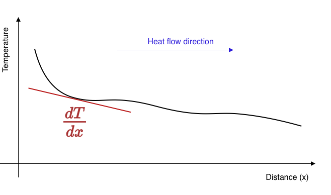{height="300px" fig-align="center"}

::::{.columns style='display: flex; align-items: center;'}

:::{.column style='width:20%; display: flex; align-items: center;'}
$$ q = - k \frac{dT}{dx} $$
:::

:::{.column style='width:80%; display: flex; align-items: center;'}
$q, (W/m^2)$ is called the heat flux and measures the flow of heat per unit area perpendicular to the temperature gradient
:::

::::

## Conduction & Fourier's Law - iii

If the heat flux into a region is not balanced by the heat flux out, the region must change temperature. For example, if more heat flow into a region than is flowing out, it will become warmer.

<!-- :::{style="width:80%; text-align: left; margin: 0 auto;"}
{height="300px"}
::: -->

::::{.columns style='display: flex; align-items: center;'}

:::{.column  style='width:35%; display: flex; align-items: center;'}
*The heat flow in the diagram is away (in both directions) from the high temperature to the cooler areas. The loss of heat from this region is balanced by a reduced temperature.*
:::

:::{.column width="5%"}
&nbsp;
:::

:::{.column width="60%"}
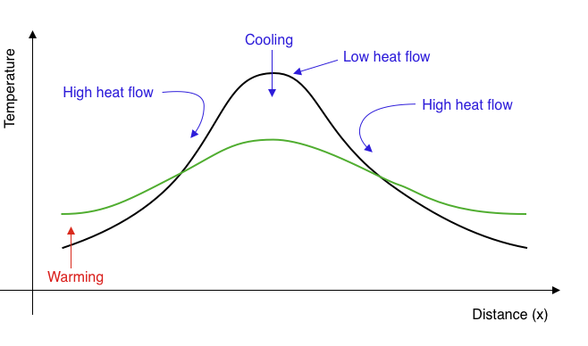{.r-stretch}
:::

::::

This process reduces the amplitude of temperature variations over time and makes the temperature smoother. **Temperature extremes become smaller, gradients become lower, the heat flux everywhere becomes smaller: the temperature differences *decay* through time.**

## Conduction & Fourier's Law - iv

If a region has a different heat flux in v. out, then there must be a gradient in the heat flux. A change in temperature is driven by gradients in the heat flux like this:

$$
   \frac{\partial T}{\partial t} =  -\frac{1}{\rho C_p} \frac{\partial q}{\partial x} + H
$$

$H$ is internal heat generation which is often important in the Earth because of the decay of radioactive isotopes.  Now we substitute for $q$ from Fourier's Law and have this expression:

$$
   \frac{\partial T}{\partial t} =  \frac{k}{\rho C_p} \frac{\partial^2 T}{\partial x^2} + H
$$

Fourier was one of the first to solve this mathematically and developed
his method of summing harmonics (series solutions) as part of this study.

## Newton's Law of Cooling

Another example of "thermal decay" occurs when we have a
hot body in a cool environment loosing heat through its surface
according to the Fourier Law.

::::{.columns style='display: flex; align-items: center;'}

:::{.column  style='width:55%;'}

The heat flux is proportional to the difference in temperature between the hot object and the surroundings, so

$$
  \frac{dT}{dt} \propto T - T_0  \quad \rightarrow \quad T = T_1 e^{-\lambda t}
$$

This is exactly the same equation for the anomalous temperature as for the quantity
of a radioactive isotope remaining after a certain time
and has the same solution with $\lambda$ a constant for a particular experiment.
:::

:::{.column width="40%"}
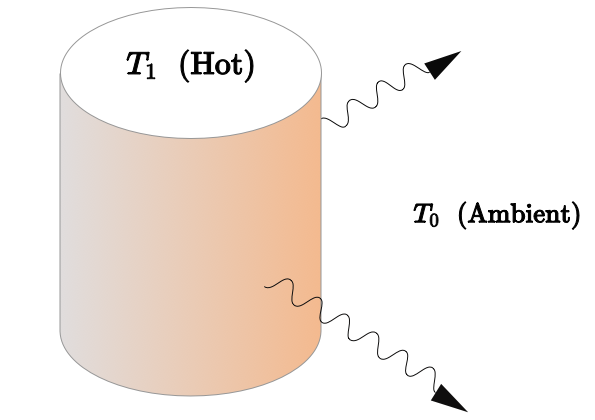{.r-stretch}
:::

::::

# Thermal Diffusion and Planetary Heat flow

The rate of heat loss is a primary controller of how a planet evolves.

  - The heat loss controls the internal temperature of the planet and
   its mechanical properties are expected to be dependent on temperature

  - The rate of heat loss from the interior is related to the energy
    available to supply mechanical work to deform the planet

  - The rate of heat loss governs the amount of time the planet can remain
    "geologically" active before the interior stops exchanging with the surface / atmosphere.

# Surface temperature and Heat loss

The Stefan-Boltzmann law tells us the rate at which a hot object loses heat to its surroundings.

$$
P = \varepsilon \sigma A \left( T^4_\textrm{hot} - T^4_\textrm{ambient} \right)
$$

The average surface temperature of the Earth is about 15°C or 288K.
This implies a loss of heat at a rate of 2 x 10^17^ W globally (to the chill of space)
We can make some assumptions about the energy content of the Earth to
see how long this can be sustained.

$$
  \require{cancel}
  \require{color}
  \frac{dE}{dt} = \frac{dE}{dT} { \color{blue} \frac{dT}{dt} } =
  \varepsilon \sigma A \left( T^4_\textrm{hot} - \bcancel{T^4 _\textrm{ambient}} \right)
$$

$$
  \require{cancel}
  t_\textrm{cooling} =
      \frac{\rho C_p V_\oplus}{\varepsilon \sigma A_\oplus}
      \int^{T_\mathrm{final}}_{T_{initial}} \frac{1}{T^4}dT =
      \frac{\rho C_p R_\oplus}{3 \varepsilon \sigma}
      \left( \frac{1}{T^3_\mathrm{final}} -
             \bcancel{\frac{1}{T^3_\mathrm{initial}}}
      \right)
$$

[Online Calculator Tool](http://hyperphysics.phy-astr.gsu.edu/hbase/thermo/cootime.html#c2) (interactive version)

## Surface temperature and Heat loss (2)

Assuming an initial temperature of 1500K (molten rock observed at the Earth’s surface)
gives a cooling time of **250,000 years**.

That’s quite young !

What is missing / incorrect in this analysis ?

 - The incoming radiation from the sun (estimated 1.75 x 10^17^ W) implies
   the Earth’s surface is near equilibrium with the solar radiation
   and therefore we should not assume cooling to the cold depths of outer space
   (how long has this near-equilibrium been established ?)

 - The assumption that the Earth’s interior is isothermal
 - The assumption that heat loss from the interior to the surface is perfectly efficient

This analysis might be quite useful for a molten planet (magma ocean)
where the heat transport in a vigorously convecting interior is very efficient.
Once the planet begins to crystallise, conductive cooling through the
chilled surface layers becomes the rate-controlling process.

# Solution for the uniform conduction of heat out of a sphere

:::: {.columns}

::: {.column width="65%"}
What is the **equilibrium** heat flow across a thin spherical shell ?

 - Heat flux in balances heat flux out
 - Account for heat generation within the shell

$$ Q_r = 4\pi r^2 \cdot q_r(r) $$

$$ Q_{r+\delta r} = 4\pi (r+\delta_r)^2 \cdot q_r(r+\delta_r) $$

:::

::: {.column width="30%"}
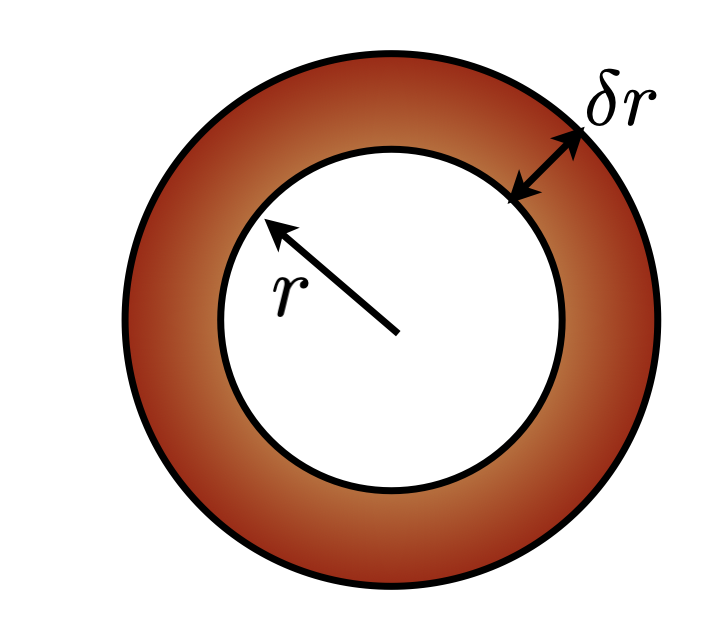{fig-align="right"}
:::

::::

The steady solution has this form

$$
  T = -\frac{\rho H}{6 k} r^2 + \frac{C_1}{r} + C_2
$$

Which is only interesting if there is internal heating ($H$)
and otherwise implies constant temperature / no additional heat at depth.
Steady-state, of course, tells us nothing about the age of the Earth.
$C_1$ has to be zero, for the solution to be meaningful at $r=0$.

# Transient solution for a sphere cooling from a uniform T

The transient (i.e. interesting) equivalent to this problem is qualitatively
different from the steady one. There are now variations with time and these
trade-off with variations in the radial direction.

Fourier’s approach was to find solutions in the form of a series of terms,
each of which individually satisfies the equations, but none of which, in isolation,
looks much like the actual solution.

The equation we want to solve looks like this:

$$
  \frac{\partial T}{\partial t} = \frac{1}{r^2} \frac{\partial}{\partial r}
                                  \left( \frac{1}{r^2}\frac{\partial T}{\partial r}\right)
$$

It says that the temperature changes due to radial temperature gradients and,
equally, that radial temperature gradients are established by the changes in temperature.

**NOTE:** I have left out the material “constants” like thermal conductivity, radius of the sphere, density which means I am assuming these are all 1 (and constant)

## Transient solution for a sphere cooling from a uniform T (2)

$$
  \frac{\partial T}{\partial t} = \frac{1}{r^2} \frac{\partial}{\partial r}
                                  \left( \frac{1}{r^2}\frac{\partial T}{\partial r}\right)
$$

We can look for solutions that take the form ...

$$
  T(r,t) = \frac{2}{r} \sum_{n=1}^{\infty}
                          \exp\left( n^2\pi^2 t \right) \sin(n\pi r) \cdot
                        \int_0^1 {\color{red}{f_T(r^*)}} \cdot r^* \sin(n\pi r^*) dr^*
$$

The term in red is the initial temperature distribution.
If we assume that this is uniform everywhere, then this is simplified
to the point where we can easily evaluate the solution:

$$
  T(r,t) = \frac{2}{r} \sum_{n=1}^{\infty}
                          \exp\left( n^2\pi^2 t \right) \sin(n\pi r) \cdot
                        \left( \frac{\sin(n\pi) - n \pi \cos(n\pi)}{n^2 \pi^2}  \right)
$$

## Transient solution for a sphere cooling from a uniform T

$$
  T(r,t) = \frac{2}{r} \sum_{n=1}^{\infty}
                          \exp\left( n^2\pi^2 t \right) \sin(n\pi r) \cdot
                        \left( \frac{\sin(n\pi) - n \pi \cos(n\pi)}{n^2 \pi^2}  \right)
$$

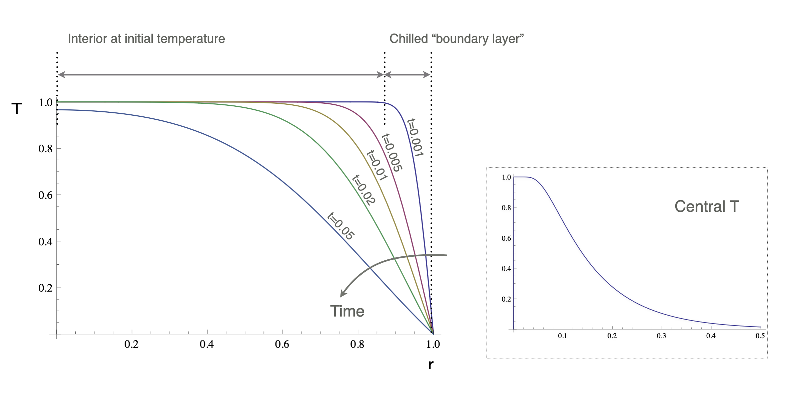{width="90%" }

## Transient solution for a sphere cooling from a uniform T

$$
  T(r,t) = \frac{2}{r} \sum_{n=1}^{\infty}
                          \exp\left( n^2\pi^2 t \right) \sin(n\pi r) \cdot
                        \left( \frac{\sin(n\pi) - n \pi \cos(n\pi)}{n^2 \pi^2}  \right)
$$

The temperature gradient at the surface is found by differentiating this
expression w.r.t. $r$ and evaluating at $r=1$

$$
  \frac{\partial T}{\partial r}(1,t) = -\sum_{n=1}^{\infty}
                        \frac{2 e^{-n^2\pi^2 t}
                             \left( n\pi \cos(n\pi) -\sin(n\pi) \right)^2}{n^2 \pi^2}
$$

The surface heat flux is then given by

$$
  q_0 = -k\frac{\partial T}{\partial r}(1,t)
$$

## Transient solution for a sphere cooling from a uniform T

$$
  \frac{\partial T}{\partial r}(1,t) = -\sum_{n=1}^{\infty}
                        \frac{2 e^{-n^2\pi^2 t}
                             \left( n\pi \cos(n\pi) -\sin(n\pi) \right)^2}{n^2 \pi^2}
$$

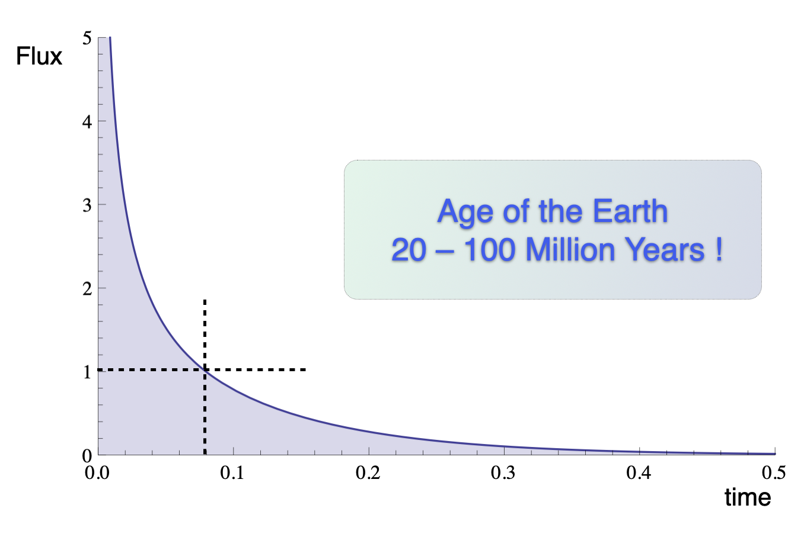{width="50%" }

This is, essentially, the simplest version of estimate by Lord Kelvin for the age of the Earth
based on a uniform internal temperature. Nobody really liked his conclusion – it was too old to satisfy the biblical literalists, and too young to satisfy their opponents: the evolutionist / biologists and the geologists.

## Transient solution for a sphere cooling from a uniform T

$$
  \frac{\partial T}{\partial r}(1,t) = -\sum_{n=1}^{\infty}
                        \frac{2 e^{-n^2\pi^2 t}
                             \left( n\pi \cos(n\pi) -\sin(n\pi) \right)^2}{n^2 \pi^2}
$$

{width="50%" }

**Analogy:** In any good murder-mystery, when somebody finds a body, the 'time of death' is estimated by measuring the body temperature. We know the initial temperature, so the cooling calculation is the same as this one.

## Transient solution for a sphere cooling from a uniform T (details)

$$
  T(r,t) = \frac{2}{r} \sum_{n=1}^{\infty}
                          \exp\left( n^2\pi^2 t \right) \sin(n\pi r) \cdot
                        \left( \frac{\sin(n\pi) - n \pi \cos(n\pi)}{n^2 \pi^2}  \right)
$$

Ignoring how we come by this (complicated-looking) solution for the time being,
what do these terms actually look like ?

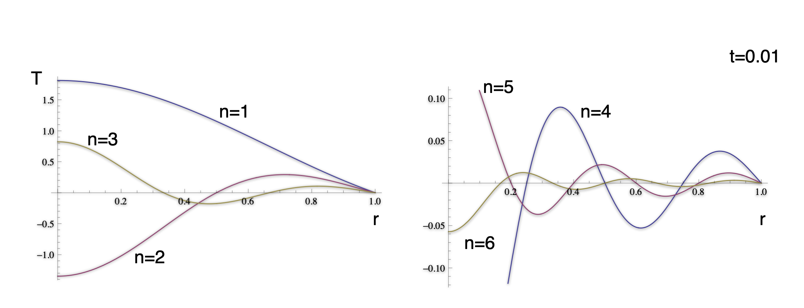{height="300px" fig-align="center"}

A fundamental objection to Fourier's original approach to solving equations by
series solution is that the harmonics can violate the boundary conditions and other
physical constraints.

## Transient solution for a sphere cooling from a uniform T (details)

$$
  T(r,t) = \frac{2}{r} \sum_{n=1}^{\infty}
                          \exp\left( n^2\pi^2 t \right) \sin(n\pi r) \cdot
                        \left( \frac{\sin(n\pi) - n \pi \cos(n\pi)}{n^2 \pi^2}  \right)
$$

How do the harmonics look when added together to give an approximation to the
solution ?

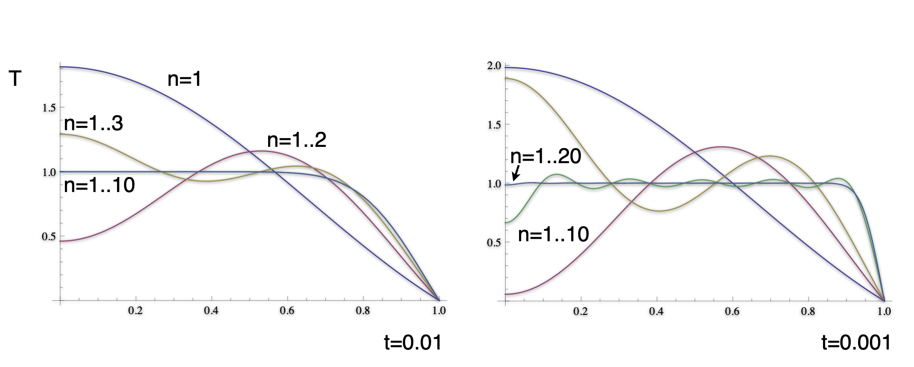{height="300px" fig-align="center"}

The solution *does* satisfy the boundary conditions and the
physical constraints. **Note** that the smaller time solution has
much sharper gradients and many more terms are required to accurately
approximate the solution.

# The cooling of a semi-infinite domain

::::{.columns}

:::{.column style='width:40%;'}

$$
\newcommand{\erfc}{\mathop{\rm erfc}\nolimits}
T = \erfc\left(\frac{z}{2\sqrt{t}}\right)
$$

This is a very different solution strategy to the cooling sphere
(and yet they should, in a mathematical sense,
approach each other as the radius becomes large).

The solution looks **very similar** in character: a cooling
front which propagates in from the surface.
The curves are self-similar, they just differ by a scaling factor.
:::

:::{.column style='width:60%;'}

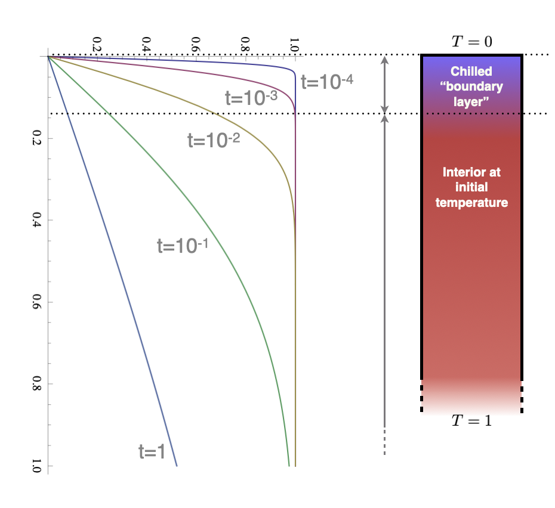{width="100%" }

:::

::::

## The cooling of a semi-infinite domain

::::{.columns}

:::{.column style='width:75%;'}

This is a problem not unlike the cooling sphere,
but with no inherent length scale that comes from the boundary
conditions. The equations are similar but we are working
in a Cartesian geometry (and also ignoring all the constants !)

$$
  \frac{\partial T}{\partial t} = \frac{\partial^2 T}{\partial z^2}
$$

This equation simplifies to an ODE if we make the following substitution,

$$
  T^* = 1-T; \quad \eta = \frac{z}{2\sqrt{t}} \quad \rightarrow
      -\eta\frac{d T^*}{d \eta} = \frac{1}{2}\frac{d^2 T^*}{d \eta^2}
$$

Which has the following solution

$$
\newcommand{\erf}{\mathop{\rm erf}\nolimits}
\newcommand{\erfc}{\mathop{\rm erfc}\nolimits}
  T^* = 1-\frac{2}{\sqrt{\pi}} \int_0^\eta e^{-\xi^2} d\xi
      = 1 - \erf(\eta)
      = \erfc\left(\frac{z}{2\sqrt{t}}\right)
$$
:::

:::{.column style='width:25%;'}

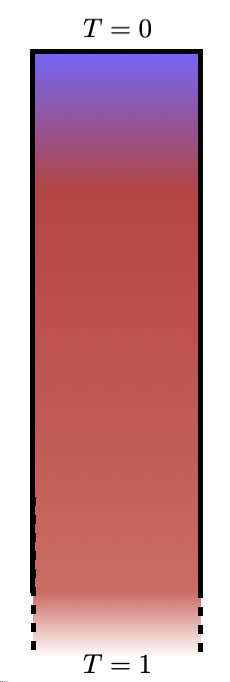{width="60%" }

:::

::::

# Pause — Questions ?

# Index

 - [Slides: Solar System Solid Planets](Slides-SS-SolidPlanets.html)
 - [Slides: Solid Planets 1](Slides-PlanetaryGeophysics-1.html)
 - [Slides: Solid Planets 2](Slides-PlanetaryGeophysics-2.html)
 - [Slides: Solid Planets 3](Slides-PlanetaryGeophysics-3.html)
