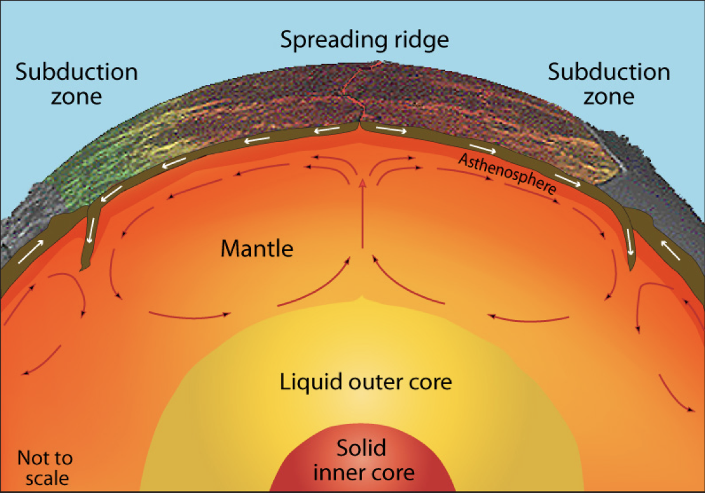
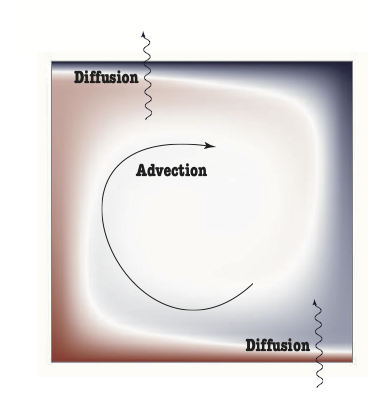
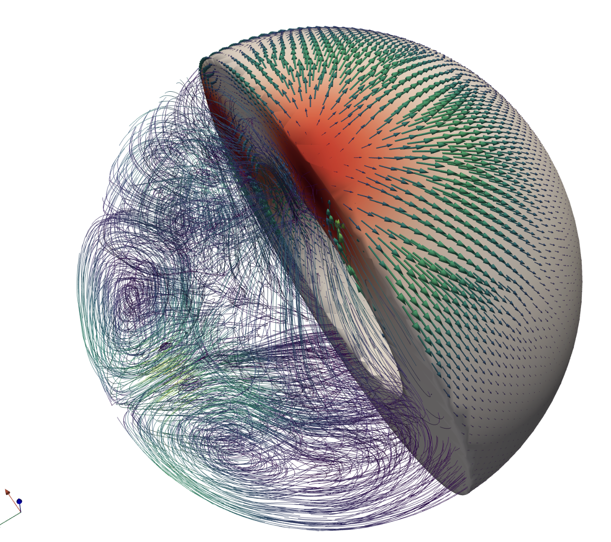
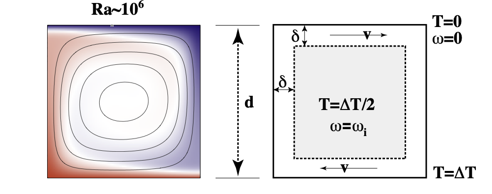
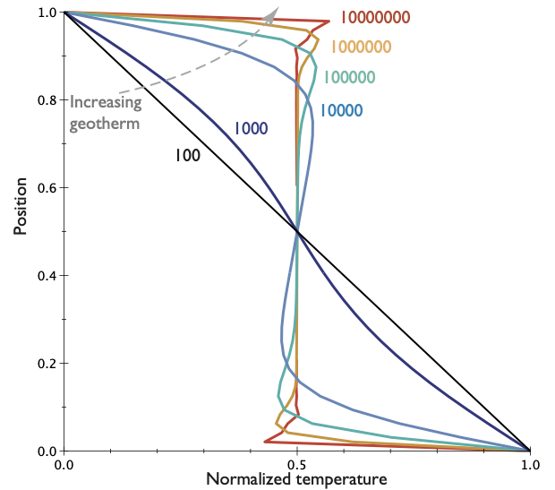
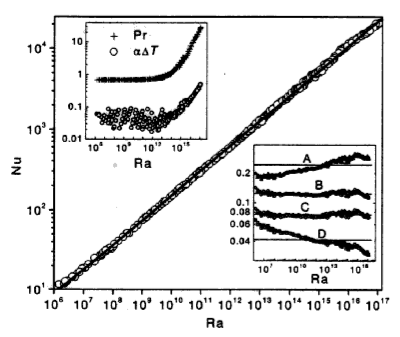
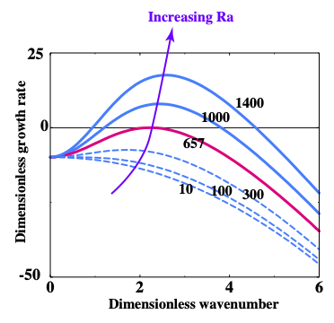

# Probing Planetary Interiors

Let us revisit heat flow / cooling in the context of an actively convecting planet.

{fig-align="center" height="300px"} &nbsp;
{fig-align="center" height="300px"}

In rigid bodies, we have diffusion and heat production to worry about, but in fluids, heat can be carried from place to place by advection.

 - On geological timescales, all planets behave like viscous fluids.
 - How does the heat flow change when convection plays a role in heat transfer ?
 - Can we quantify the relationship between internal heat and the geotherm as we can in rigid bodies&nbsp;?

 # General Observations on Convection

**Definition**:  Convection is the transfer of heat by the self-organised movement of a fluid. Free convection is when the fluid is stirred entirely by rising buoyant material and sinking negatively-buoyant material. (Forced convection is produced when the fluid is stirred mechanically).

<video autoplay controls width="33%">
    <source src="movies/LavaLampNormalSpeed.m4v"
            type="video/mp4">

    Sorry, your browser doesn't support embedded videos.
</video>

Convection is one of the ways we transfer heat from hot regions deep in the Earth to cooler, shallow regions. **Convection is a form of heat engine that turns heat into mechanical work**.  This is important because it is the only process within the planet that can produce flow, and **surface tectonism** beyond simple, thermal contraction.

# Quantitative lava lamp model

<video autoplay controls width="33%">
    <source src="movies/LavaLampNormalSpeed.m4v"
            type="video/mp4">

    Sorry, your browser doesn't support embedded videos.
</video>

The heat flow in a system that is convecting is always larger than the heat flow would be if the fluid were not moving (all other things being equal). The heat flow is larger by a ratio that is called *the Nusselt number* or $\textrm{Nu}$ and

$$
  \textrm{Nu} \propto \textrm{Ra}^{1/3}
$$

Where, $\textrm{Ra}$, is the *Rayleigh number*

$$
  \textrm{Ra} = \frac{g \rho_0 \alpha \Delta T}{\eta \kappa}
$$

What is the Rayleigh number / where does it come from  ?

#  Navier-Stokes Equation / Convection

**Rayleigh number** - measures the intensity of the buoyancy forces and their ability to counter the effects
of thermal diffusion and viscosity in damping motion driven by buoyancy

$$
\mathrm{Ra} = \frac{g \rho \alpha \Delta T d^3}{\eta \kappa}
$$

**Prandtl number** - measures the relative importance of stress diffusion and thermal diffusion and is purely a
material property (no reference to the geometry, length- or time-scales).

$$
\mathrm{Pr} = \frac{\eta}{\rho \kappa} = \frac{\nu}{\kappa}
$$

**Reynolds number** - measures the relative importance of inertial to viscous forces. The Reynolds number is commonly
used in fluid dynamics where it is an indicator of the transition from steady flow, unsteady laminar flow, through to
turbulent flow.

$$
\mathrm{Re}=\frac{\rho V_0 d}{\eta} = \frac{V_0 d}{\nu}
$$

The Reynolds number does not contain any reference to the thermal state but this means that there is no natural length/time scaling and so the definition can be subjective.

## Navier-Stokes Equation / Convection

The (in)famous equation of fluid dynamics is the Navier-Stokes equation:

$$
\rho \left( \frac{\partial \mathbf{v}}{\partial t}
                           + (\mathbf{v} \cdot \nabla) \mathbf{v} \right) =
                           \eta \nabla^2 \mathbf{v} - \nabla p
                           - g \rho_0 \alpha \left( T - T_0 \right)  {\mathbf{z}}
$$

$$
\left( \frac{\partial T}{\partial t} + \mathbf{v} \cdot \nabla T \right)=
                        \kappa \nabla^2 T + \frac{H}{C_p}
$$

We combine Navier-Stokes equation driven by thermal buoyancy, and the expression for
the time-evolution of the temperature field. The two equations are coupled through $T$.
The various physical properties and their units are listed below.

$$
\begin{array} {l|l|l}
  \hline \textrm{Viscosity}           & \eta             & Pa \cdot s \\
  \hline \textrm{Temperature scale}   & \Delta T = T-T_0 & K \\
  \hline \textrm{Lengths}             & x                & m \\
  \hline \textrm{Thermal expansivity} & \alpha           & K^{-1} \\
  \hline \textrm{Gravity}             & g                & m.s^{-2} \\
  \hline \textrm{Density}             & \rho             & kg.m^{-3} \\
  \hline \textrm{Thermal diffusivity} & \kappa           & m^2.s^{-1} \\
  \hline
\end{array}
$$

## Navier-Stokes Equation / Convection

We can't hope to solve the Navier-Stokes equation, except in a few, trivial cases, but we can do something else. We do a form of dimensional analysis to write every symbol side-by-side with its basic units.

$$
\frac{\rho_0 \kappa}{d^2} \frac{D}{Dt'} \left( \frac{\kappa}{d} \mathbf{v}' \right) =
                \frac{\eta}{d^2} \acute{\nabla}^2 \left( \frac{\kappa}{d} \mathbf{v}' \right)
                - \frac{\eta \kappa}{d^3}  \acute{\nabla} p' + g \rho_0 \alpha \Delta T T' {\mathbf{z}}
$$

The equation then looks like this:

$$
\begin{aligned}
    \frac{\rho \kappa}{\eta} \frac{D\mathbf{v}'}{Dt'}  & =
                     \acute{\nabla}^2  \mathbf{v}'  -  \acute{\nabla} p' +
                     \frac{g \rho_0 \alpha \Delta T d^3}{\kappa \eta} T' {\mathbf{z}} \nonumber \\
           & \textrm{or} \\
    {\color{DarkRed}\frac{1}{{\rm Pr}}} \frac{D\mathbf{v}'}{Dt'} & =
    \acute{\nabla}^2  \mathbf{v}'  -
    \acute{\nabla} p' + {\color{DarkRed} {\rm Ra}} T' {\mathbf{z}}
\end{aligned}
$$

The new parameters in the equation are dimensionless ratios, and show how to expand the equation back to its original form.

##  Navier-Stokes Equation / Convection

Questions

  - What is the Prandtl number for (1) Water, (2) A planet ?
  - What is the Reynolds number for plate-tectonic motions ?
  - Estimate the Rayleigh number for the Earth.

Discussion points:

  - If the Prandtl number is very large, how long does it take for the Navier-Stokes equation
    to adjust to changes in buoyancy forces or boundary conditions ?

  - What is the Reynolds number for mantle flow / plate tectonics ?
    How about for flow in the Earth's outer core ?

  - A similar scaling question: what (roughly) is the kinetic energy of the Pacific plate ?

# Thermal Convection

In very-viscous convection, only the Rayleigh number plays a role
($\mathrm{Re}\rightarrow 0$ and $\mathrm{Pr} \rightarrow \infty$)

{style="height:500px; float:right"}

The structure of the flow and the pattern of the temperature field is predictable once we know the Rayleigh number but it is helpful first to develop some feeling for the patterns by seeing them.

 

*Blue  is cool, red is warm. The bottom of the box is kept hot, the top cold and the difference in temperature is $\Delta T$, the depth of the box is $d$ and so on. These numbers are set up so that the Rayleigh number is the required value. In a lab experiment, the simplest parameter to change is $\Delta T$ assuming that the material has a constant viscosity with $T$ and does not freeze, melt, burn or boil.*

## Thermal Convection

Rayleigh number: $Ra=10,000$

<video autoplay controls loop height="500">
    <source src="movies/Ra1e4.m4v"
            type="video/mp4">
    Sorry, your browser doesn't support embedded videos.
</video>

## Thermal Convection

Rayleigh number: $Ra=100,000$

<video autoplay controls loop height="500">
    <source src="movies/Ra1e5.m4v"
            type="video/mp4">
    Sorry, your browser doesn't support embedded videos.
</video>

## Thermal Convection

Rayleigh number: $Ra=1,000,000$

<video autoplay controls loop height="500">
    <source src="movies/Ra1e6.m4v"
            type="video/mp4">
    Sorry, your browser doesn't support embedded videos.
</video>

## Thermal Convection

Rayleigh number: $Ra=10,000,000$

<video autoplay controls loop height="500">
    <source src="movies/Ra1e7.mp4"
            type="video/mp4">
    Sorry, your browser doesn't support embedded videos.
</video>

# Thermal Convection in a wide box

Rayleigh number: $Ra=1,000,000$

<video autoplay controls loop height="250">
    <source src="movies/Ra1e6-4x1.m4v"
            type="video/mp4">
    Sorry, your browser doesn't support embedded videos.
</video>

The pattern is not changed much when we make the box a little wider

# Thermal Convection in Curved Boxes

Rayleigh number: $Ra=1,000,000$

<video autoplay controls width="33%">
    <source src="movies/Annulus1e6_large_core.m4v"
            type="video/mp4">

    Sorry, your browser doesn't support embedded videos.
</video>

<video autoplay controls width="33%">
    <source src="movies/Annulus1e6_normal_core.m4v"
            type="video/mp4">

    Sorry, your browser doesn't support embedded videos.
</video>

<video autoplay controls width="33%">
    <source src="movies/Annulus1e6_tiny_core.m4v"
            type="video/mp4">

    Sorry, your browser doesn't support embedded videos.
</video>

Nor does it make a qualitative difference if we account for the Earth's curvature

## Flat Earth, Round Earth, 3D

{style="height:500px;"}

In the sphere, the patterns are harder to see by eye, but it turns out that we can draw general conclusions from the 2D cases and they still hold in 3D.

# Understanding Thermal Convection

{style="height:300px;"}

A relatively simple pattern emerges from the competition between advection of heat by fluid flow and diffusion:

  - Convection cells that become independent
  - Boundary layers where horizontal advection balances vertical diffusion
  - Rotation in the middle of the box without much deformation

## Understanding Thermal Convection

{style="height:200px;"}

Convection length and timescales are determined by the Rayleigh number.

  - High $\mathrm{Ra}$ narrower boundary layers, higher temperature gradients
  - High $\mathrm{Ra}$ more likely to be time-dependent, unsteady
  - Low $\mathrm{Ra}$, convection suddenly shuts off

We will see this picture again when we consider the patterns of heat flow in the Earth's ocean floor.

## Average temperature

{style="height:450px;"}
{style="height:450px;"}

The temperature (velocity, stress etc) profiles vary systematically with $\mathrm{Ra}$.

# Critical Rayleigh number

It can be a little difficult to see from a small set of movies, but if we reduce the Rayleigh number enough, conduction completely wins over advection and no motion takes place at all.

{style="height:400px;float:right;"}

This can be approached theoretically, and we find that there is a critical value of the Rayleigh number and a critical wavelength where this transition occurs.

$$\mathrm{Ra}_c = \frac{27}{4} \pi^4 = 657.51 $$

and

$$ k = \frac{\pi}{\sqrt{2}} = 2.22 $$

If $\mathrm{Ra} \gg \mathrm{Ra}_c$ then convective motion is inevitable

# Discussion: Ra for the Earth's Mantle

Calculate the Rayleigh number for the Earth's mantle.

$$\mathrm{Ra}_{\textrm{Earth}} = ?$$

Use the following values:

  - Gravity, $g \approx 10 \mathrm{m/s}^2$ through the mantle
  - Density, $\rho_0 \approx 3000 \mathrm{kg/m}^3$
  - Thermal Expansivity, $\alpha \approx 10^{-5} \mathrm{K}^{-1}$
  - Temperature drop, $\Delta T \approx 2000 \mathrm{K}$
  - Thickness of the mantle, $d \approx 3000 \mathrm{km}$
  - Thermal diffusivity, $\kappa \approx 10^{-7} \mathrm{m}^2 / \mathrm{s}$
  - Viscosity, $\eta \approx 10^{22} \mathrm{Pa.s}$

 - **Is it above the critical value ?**
 - **What does that tell us ?**
 - **How about Mars ?**

# Convection: Summary

Convection is a heat engine (i.e. it converts heat energy into mechanical work)

Convection is a balance between heat transported by fluid motion and diffusion.
The fluid self-organises to create large scale patterns *“out of nowhere”*

In tanks of viscous fluids like syrup or honey, convection depends on just the one free parameter which is a combination of fluid properties, geometry and boundary conditions — this is called the Rayleigh number (Ra).

If we know Ra, we can predict the heat flow and typical velocity of the system

If Ra is below a critical value, convection dies away but if it is more than (about) ten times this value then convection cannot be suppressed. The Earth’s mantle is very much super-critical and so it must be convecting.

None of these simple models actually produce plate tectonics but they do still tell us about the heat flow in the Earth.

# End — Questions ?!

# Index

 - [Slides: Solar System Solid Planets](Slides-SS-SolidPlanets.html)
 - [Slides: Solid Planets 1](Slides-PlanetaryGeophysics-1.html)
 - [Slides: Solid Planets 2](Slides-PlanetaryGeophysics-2.html)
 - [Slides: Solid Planets 3](Slides-PlanetaryGeophysics-3.html)
